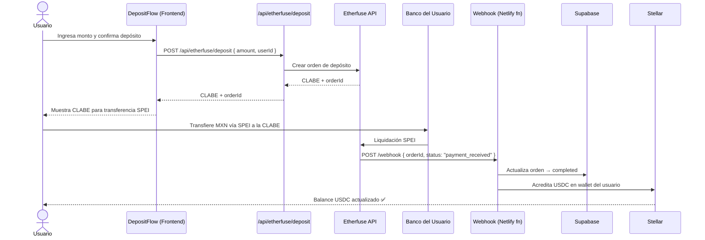
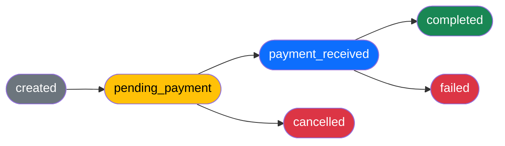

# Mañana Seguro 🛡️

**USDC retirement savings on Stellar — built for Mexico's informal workers.**

Mañana Seguro is a DeFi platform that lets delivery drivers, street vendors, and freelancers save for retirement starting from $2 USDC, earning real yield through tokenized CETES via Etherfuse — no bank, no AFORE, no middlemen.

> Built during the **Stellar Genesis Hackathon**.

---

## The problem

32 million Mexicans work in the informal economy with no access to IMSS, AFORE, or pension plans. Mañana Seguro gives them a decentralized alternative, accessible from any device via browser or Telegram.

**Carlos, 32-year-old delivery driver:**
- Saves $25 USDC/month for 20 years
- Earns ~4.70% net APY in USDC (CETES via Etherfuse)
- Result: **$244,000 MXN at retirement** — saving ~$425 pesos/month

---

## Architecture

```
MananaSeguro/
├── CreditRoot/              # Frontend — React 19 + Vite + Bootstrap 5
│   ├── src/features/        # dashboard, simulator, withdrawal, referrals, planner
│   ├── src/screens/         # Landing, Auth, Home, Dashboard, Planner, Withdrawal
│   ├── src/lib/             # stellar.js (Soroban SDK), wallet.js (Freighter)
│   └── src/hooks/           # useEtherfuseRate, useRetirementProjection
│
├── manana-seguro-bot/       # Telegram bot — Python + Claude Haiku (Anthropic)
│   ├── bot.py               # Handlers, retirement simulator, AI advisory
│   └── stellar_connection.py # Stellar testnet integration
│
└── netlify/functions/
    └── cetes-rate.js        # CORS proxy for the Etherfuse API
```

### Flujo de depósito SPEI → Stellar / SPEI → Stellar deposit flow

El usuario inicia un depósito desde el frontend, que solicita una CLABE a Etherfuse. El usuario transfiere pesos vía SPEI a esa CLABE. Etherfuse confirma el pago, notifica a nuestro webhook, que registra la orden en Supabase y acredita USDC en la wallet Stellar del usuario.

> The user starts a deposit from the frontend, which requests a CLABE from Etherfuse. The user sends MXN via SPEI to that CLABE. Etherfuse confirms payment, notifies our webhook, which records the order in Supabase and credits USDC to the user's Stellar wallet.



### Máquina de estados de la orden / Order state machine

Cada depósito pasa por los siguientes estados. Si el pago no llega o es rechazado, la orden puede terminar en `failed` o `cancelled`.

> Each deposit transitions through the following states. If payment is not received or is rejected, the order may end in `failed` or `cancelled`.



---

## Tech stack

| Layer | Technology |
|---|---|
| Frontend | React 19, Vite, Bootstrap 5 |
| Wallet | Freighter (Stellar) |
| Blockchain | Stellar Testnet + Soroban SDK |
| Yield | Etherfuse Stablebonds (tokenized CETES) |
| Bot | Python 3, python-telegram-bot 21, Claude Haiku |
| Deploy | Netlify (with serverless functions) |

---

## Features

- **Live retirement calculator** — with real CETES rate from Etherfuse
- **Non-custodial wallet connection** — via Freighter
- **Savings dashboard** — locked balance, goal progress, contribution history
- **Interactive simulator** — personalized projections with loyalty incentives
- **Emergency auto-loan** — up to 30% of balance at 0.5%/month, 24 months
- **Telegram bot** — AI-powered advisory, simulator, and balance management from your phone

---

## Local setup

### Requirements

- Node.js 18+
- Python 3.10+
- [Freighter](https://freighter.app/) browser extension
- Stellar Testnet account with test USDC

### Frontend (CreditRoot)

```bash
cd CreditRoot
npm install
npm run dev
```

Runs at `http://localhost:5173`. The Etherfuse proxy runs automatically at `/api/cetes-rate` during development.

### Telegram bot (manana-seguro-bot)

```bash
cd manana-seguro-bot
pip install -r requirements.txt
cp .env.example .env
# Fill in your credentials
python bot.py
```

### Environment variables (bot)

Create a `.env` file inside `manana-seguro-bot/` based on `.env.example`. **Never commit this file.**

```env
TELEGRAM_TOKEN=your_botfather_token
ANTHROPIC_API_KEY=your_anthropic_api_key
```

- **TELEGRAM_TOKEN** → talk to [@BotFather](https://t.me/BotFather) on Telegram
- **ANTHROPIC_API_KEY** → [console.anthropic.com](https://console.anthropic.com)

---

## Deploy

The frontend deploys automatically to Netlify on push to `main`.

```toml
# netlify.toml
[build]
  command = "cd CreditRoot && npm install && npm run build"
  publish = "CreditRoot/dist"
```

The `cetes-rate` serverless function acts as a CORS proxy between the browser and the Etherfuse API.

---

## Contributing

Want to contribute? Read [CONTRIBUTING.md](./CONTRIBUTING.md) first.

This repository participates in the **[Stellar Wave Program](https://www.drips.network/wave/stellar)** — a monthly open source contribution cycle with real rewards. Issues labeled `wave` are the priority each cycle.

---

## Team

| Name | Role |
|---|---|
| Davor | Frontend + Backend + Blockchain |
| Ulises | Frontend + Telegram Bot |
| Nano | Frontend |
| Daniel | Pitch |
| Renata | Pitch |

---

## License

[MIT](./LICENSE)

---

> **Mañana Seguro runs on Stellar Testnet.** Do not use real funds. All activity happens on Stellar's test network.
